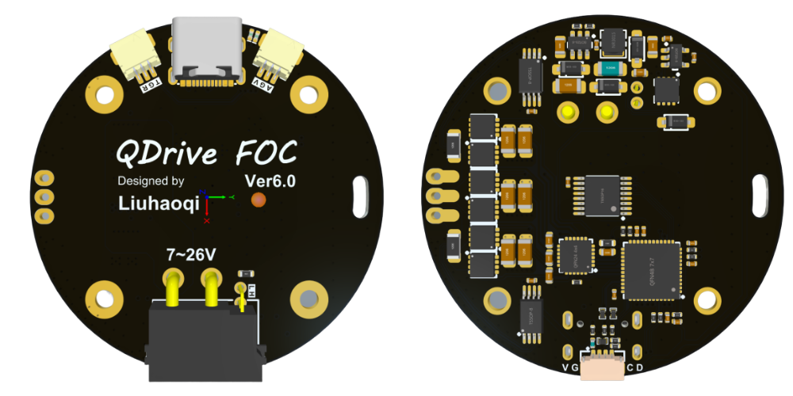

# QDrive - 高性能轻量化FOC实例

此为软件部分，硬件部分参见：[QDrive-硬件部分](https://github.com/Liu-Curiousity/QDrive-Hardware)

您可以复刻此项目的硬件部分，或购买QDrive成品驱动板：[QDrive成品驱动板](https://e.tb.cn/h.hvxbdqyMjSPHMGw?tk=HijG4lsnjo0)。

[//]: # (![]&#40;./Doc/Images/PCB渲染图.png "PCB渲染图"&#41;)

[//]: # ()

[//]: # (![]&#40;./Doc/Images/电机渲染图.png "电机渲染图"&#41;)

## 简介

QDrive是一个基于STM32G431系列MCU的高性能FOC控制器，旨在提供一个轻量级、易于使用的FOC解决方案。支持多种电机类型，并且具有高效的电流控制和速度控制功能。

此工程仅适用于4310电机QDrive驱动板，如需使用其他电机，可以自行移植。

## 特性

- **高性能**：基于STM32G431系列MCU，提供强大的处理能力。
- **高精度**：采用18位编码器，可以实现0.005°的精细角度控制。
- **宽电压**：支持7-26V的电压输入，2-6S电池适用。
- **ms级响应**：经测试，可在40ms内使电机转动半圈。
- **丰富接口**：支持CAN总线通信、UART通信、PWM控制、USB控制、支持shell交互。
- **多种控制模式**：支持位置控制、速度控制和电流控制。支持角度步进模式、低速高转矩模式。
- **参数可调**：提供丰富的参数设置选项，包括三环PID参数、速度限幅、零点设置、ID设置、波特率设置等。
- **OTA升级**：支持通过USB进行固件升级，方便用户获取最新功能和修复。
- **易于使用**：提供详细的文档和示例代码，帮助用户快速上手。

## 使用方法

- [**对于开发者**](./Doc/for_developer.md)
- [**对于使用者**](./Doc/for_user.md)
